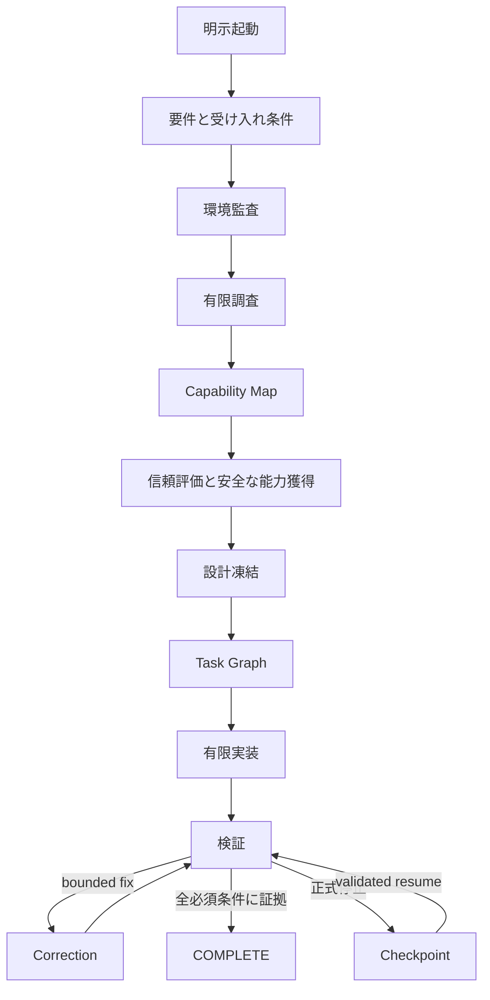

<p align="center">
  <strong>日本語</strong> · <a href="README.md"><strong>English</strong></a>
</p>

<p align="center">
  
</p>

<h1 align="center">StackMarshal</h1>

<p align="center"><strong>Codexのための、有限・Research First型Agent Harness。</strong></p>
<p align="center">調べ、揃え、制御し、有限に作り切る。</p>

<p align="center">
  <a href="https://github.com/Soph1yzzz/stackmarshal/releases/latest"></a>
  <a href="https://github.com/Soph1yzzz/stackmarshal/actions/workflows/ci.yml"></a>
  <a href="https://github.com/Soph1yzzz/stackmarshal/actions/workflows/codeql.yml"></a>
  
  
  
  
</p>

<p align="center">
  <strong><a href="#1コマンドで導入">Install</a></strong> ·
  <strong><a href="docs/CASE_STUDY_01_REPOHEALTH.ja.md">実証</a></strong> ·
  <strong><a href="docs/ARCHITECTURE.md">Architecture</a></strong> ·
  <strong><a href="docs/THREAT_MODEL.md">Security</a></strong> ·
  <strong><a href="docs/README.md">Docs</a></strong>
</p>

StackMarshalは、終わりが曖昧になりやすいCodex作業を**有限で監査可能なrun**へ変換します。
必要な場合だけ調査し、既存Capabilityを整理し、trustを評価し、Architectureを凍結し、明示的な
上限内で実装し、必須受け入れ条件を検証します。安全に完了できない場合は、再開可能な
checkpointを残します。

> StackMarshalは「どんな依頼でも必ず完成」を保証しません。
> 保証するのは、**証拠付きの`COMPLETE`か、正式かつ再開可能な有限停止**です。

## 30秒で分かるStackMarshal

<table>
  <tr>
    <td width="33%"><strong>RUNを有限化</strong><br/>budget、attempt、stagnation、terminal stateで作業をboundedに保ちます。</td>
    <td width="33%"><strong>完了を証明</strong><br/>canonical task evidenceとverificationが<code>COMPLETE</code>をgateします。</td>
    <td width="33%"><strong>安全に再開</strong><br/>integrity-protected checkpointが判断をrepository stateへ束縛します。</td>
  </tr>
</table>

| 終端が曖昧なAgent作業 | StackMarshalを使う場合 |
|---|---|
| 調査が必要か決める前に実装を始める | 明示的なResearch GateとCapability Mapを先に通す |
| 既存Toolを再実装したり、依存を気軽に増やす | Skill / MCP / plugin / library / CLI / reference OSSを分離し、獲得前にtrustを評価する |
| 実装途中でArchitectureが漂流する | Architecture Freezeを行い、再調査回数も上限化する |
| 同じ失敗をcontext切れまで繰り返す | budget、task attempt、stagnation、failure fingerprintで有限化する |
| 「終わった」と言うが完了条件が機械的に追えない | canonical task evidenceとverificationで`COMPLETE`をgateする |
| Chatが止まると再開情報も消える | repository stateに束縛されたintegrity-protected checkpointを残す |

### 他と何が違うか

- **有限性をPromptだけに任せない**：決定論的Coreがrun state、budget、stop condition、
  task evidence、terminal stateを管理します。
- **Research FirstだがResearch Alwaysではない**：小さなlocal作業は調査を省略でき、必要な作業だけ
  boundedなfield/capability調査を通してからArchitectureを凍結します。
- **Security GateがHarness内にある**：publication、secret、billing、privilege、global write、
  external binary、network writeは承認境界のままです。未知のcommand formもfail-closedします。
- **Integrityをrepository境界の外へ置く**：ユーザー領域HMACでlive run/task authority、checkpoint、
  receiptを保護し、resume時はrepository lineageと正確なworktree fingerprintにも束縛します。
- **Codex専用Adapter + Agent非依存Core**：v1はmulti-agent orchestratorではありません。
  Codex固有挙動をAdapter/Skillへ分離し、Core側は状態・Policy Modelを再利用可能にしています。

### Dogfooding実証：RepoHealth

<p align="center">
  <a href="docs/CASE_STUDY_01_REPOHEALTH.ja.md"></a>
</p>

**Case Study #1**では、CodexがStackMarshalを明示起動し、ほぼ空のlocal workspaceから
runtime dependency 0のOSS-readiness CLI「RepoHealth」を構築しました。採用runの結果は次の通りです。

- **tests 6 passed**
- **Ruff PASS**
- **strict mypy PASS**
- **branch-aware coverage 92%**（gate 85%）
- **wheel + sdist build PASS**
- **local wheel install smoke PASS**
- StackMarshal terminal state：**`COMPLETE`**

さらに、このdogfoodingは都合の悪いintegration gapも隠さず露出させ、その後のv1.1系
live-orchestration hardeningへ直接つながりました。証拠・留保・remote CI未実行条件を含む完全な記録は
[Case Study #1 — RepoHealth 日本語版](docs/CASE_STUDY_01_REPOHEALTH.ja.md)を参照してください。

### Field dogfood：MandateMarshal v0.2

**Case Study #2**では、別OSSのdurable runtime / crash recovery実装でStackMarshalを実使用しました。
5 mandatory taskを合計5 attemptで完了し、research round 1、tool calls 72を記録してfinalization後に
`COMPLETE`へ到達しました。特に、最終盤のsource変更後にverificationが古くなった状態で進もうとすると、
`missing_verified_workspace_fingerprint`で`COMPLETE`を拒否し、最終workspaceの再verificationを要求しました。

同じfield runから、v1.1.3へ持ち込むGit porcelain path parsing、launcher/CLI/Skill version skew、Windows予約device名
fingerprint診断の3件も見つかりました。その後のrisk-triggered pre-release security reviewで4件目となるunsigned live run/task authorityも見つかり、field runの歴史を書き換えずv1.1.3へ追加hardeningしています。詳細は
[Case Study #2 — MandateMarshal 日本語版](docs/CASE_STUDY_02_MANDATEMARSHAL.ja.md)（[English](docs/CASE_STUDY_02_MANDATEMARSHAL.md)）を参照してください。

### 1コマンドで導入

**Windows PowerShell：**

```powershell
irm https://github.com/Soph1yzzz/stackmarshal/releases/latest/download/install.ps1 | iex
```

**macOS / Linux：**

```bash
curl -fsSL https://github.com/Soph1yzzz/stackmarshal/releases/latest/download/install.sh | bash
```

installerは専用virtual environmentへCLIを隔離導入し、対応するCodex Skillを配置し、versioned
Release assetsを検証してpost-install doctorまで実行します。初回bootstrap後はv1.1.4から
`stackmarshal pin latest`を通常updateに使えます。v1.1.5では同一runの実resume、legacy state archival、
bounded verification correctionを追加しました。`stackmarshal version`でruntime / pin / Skill /
launcherのdriftもすぐ確認できます。詳細な導入、Security、CLI、state、release、development
contractは以下の既存説明を維持しています。

## 詳細概要

StackMarshalは、Codex向けのResearch First型オーケストレーションSkillと、
決定論的な補助CLIです。依頼の構造化、環境監査、類似OSS調査、Skills・MCP・
プラグイン・ライブラリ・CLIの探索、安全性とライセンス評価、設計凍結、有限予算での
実装、受け入れ条件の検証、停止時のcheckpoint/resumeを一つの流れにまとめます。

> StackMarshalは「どんな依頼でも必ず完成」を保証しません。
> **証拠付きの`COMPLETE`か、正式かつ再開可能な停止状態**を保証します。

## なぜ必要か

Coding Agentは、調査前に実装を始める、既存OSSを再実装する、古い・危険な依存を
選ぶ、実装中に設計を変え続ける、同じ失敗を反復する、停止時に再開情報を残さない、
といった無駄を起こしやすいです。StackMarshalはそれらを観測可能な上限と正式状態で
制御します。

## 中核となる保証

- **明示起動のみ**：通常の実装依頼では発火しません。
- **必要な場合だけResearch First**：小さな局所修正では調査を省略できます。
- **横断的なCapability Map**：Skill、MCP、プラグイン、ライブラリ、CLI、参考OSSを区別します。
- **Supply Chain防御**：pin、hash、provenance、install hook検査、最小権限、承認ゲート、rollback receipt。
- **Architecture Freeze**：再調査は重大条件に限定し、回数上限を持ちます。
- **Authenticated live authority**：1つのbounded jobに対してRUNNING runは1本だけ。live `run.json`とcanonical task graphはユーザー領域のHMACで保護し、repository内容からphase/COMPLETE権限を偽造できないようfail-closedにします。nested workspaceは親Gitを所有repoとして誤認せず、正当なrepo bootstrapはlineage migrationとして記録します。
- **Live activity budget**：観測可能なCodex作業をCore側のcounterへ接続し、実作業したのに`used=0`の帳簿を残しません。
- **Canonical Task Graph**：HMAC認証されたmachine-readableなtask状態と証拠を正本にし、Markdown viewへ同期して`COMPLETE`をgateします。
- **有限停止ハーネス**：予算、同一failure fingerprint、停滞、scope driftを検出します。
- **Checkpoint / Resume**：同じユーザー領域HMACのintegrity境界でcheckpointとacquisition receiptも保護し、`stackmarshal resume <run-id>`はproject identity、Git state、exact worktree fingerprint、signed resume phaseを検証したresumable stopだけを同一run IDで再開します。
- **Bounded Correction**：軽微なverification修正は`VERIFICATION -> CORRECTION -> VERIFICATION`で処理し、architecture replan budgetを消費しません。
- **Legacy evidenceを権威へ昇格しない**：`stackmarshal migrate`は旧unsigned stateをhash付きarchiveへ退避し、勝手に署名してcurrent authorityへ昇格しません。
- **Agent非依存Core**：v1はCodex Adapter、将来は他Agent Adapterへ拡張可能です。

## 起動方法

発火する例：

```text
StackMarshalを使って実装して。
Use StackMarshal to build this feature.
使用 StackMarshal 实现这个功能。
$stackmarshal build
```

発火しない例：

```text
この機能を実装して。
StackMarshalとは？
StackMarshalに似たOSSを比較して。
README内のStackMarshalという表記を直して。
```

## 導入・更新

推奨installerは、CLIを専用virtual environmentへ隔離導入し、同じversionのCodex Skillも
一括で配置します。version固定されたRelease assetsを`SHA256SUMS`で検証し、導入後doctorと
一時ファイル削除まで実行します。

**Windows PowerShell：**

```powershell
irm https://github.com/Soph1yzzz/stackmarshal/releases/latest/download/install.ps1 | iex
```

**macOS / Linux：**

```bash
curl -fsSL https://github.com/Soph1yzzz/stackmarshal/releases/latest/download/install.sh | bash
```

初回bootstrap後の通常updateとversion管理はCLI自身で行えます。

```bash
stackmarshal pin latest
stackmarshal pin status
stackmarshal version
```

再現性のためexact releaseへ固定する場合：

```bash
stackmarshal pin 1.1.5
```

`stackmarshal version`は人間向け確認で、実行中CLI、managed pin、installed Skill、resolved launcher、
`OK` / `DRIFTED`をまとめて表示します。`stackmarshal --version`はscript向けにruntime versionだけを
返します。`pin`は選択したpublished ReleaseのbootstrapをRelease `SHA256SUMS`で検証してから既存の
atomic installerへ委譲するため、update / repair / rollbackロジックは二重実装しません。

GitとPython 3.11以上が前提です。未導入の場合は、検出結果を説明した上でOS package managerを
使ってよいか確認します。user `PATH`の変更、または編集済み・installer管理外のSkill置換にも
確認が入ります。完全な非対話導入を意図する場合だけ、PowerShellは`-Yes`、Bashは`--yes`を
使用してください。downgradeは`-AllowDowngrade` / `--allow-downgrade`を明示しない限り拒否します。

CLIのRuntime必須依存は**ゼロ**で、現在のPython環境やglobal Pythonへは導入しません。
Skill導入・更新後はCodexを再起動してください。installerはCodex homeのSkill外にも
restart-pending markerを残します。再起動前の古いSkillはStackMarshal起動を拒否し、
再起動後に同versionの新しいSkillだけがmarkerを確認・解除してから作業を開始します。

Skillだけを手動導入する場合も、`main`ではなく対応するRelease tagへ固定します。

```text
$skill-installer install https://github.com/Soph1yzzz/stackmarshal/tree/v1.1.5/skills/stackmarshal
```

## CLI例

```bash
stackmarshal --version
stackmarshal version
stackmarshal pin status
stackmarshal repair --remove-shadowed
stackmarshal init
stackmarshal migrate --dry-run
stackmarshal invocation "StackMarshalを使って実装して"
stackmarshal start --mode build --budget standard \
  --invocation "StackMarshalを使って実装して"
stackmarshal doctor --host-skill-version 1.1.5
stackmarshal state show
stackmarshal state transition INTENT_NORMALIZATION
stackmarshal budget check
stackmarshal activity record tool-call --amount 2 --detail "bounded host-tool batch"
stackmarshal task add implement --summary "機能を実装" --acceptance "tests pass"
stackmarshal task start implement
stackmarshal task complete implement --evidence "tests/test_feature.py passed"
stackmarshal state transition CORRECTION
stackmarshal activity record correction --detail "bounded verification fix"
stackmarshal state transition VERIFICATION
stackmarshal finalize
stackmarshal state transition COMPLETE
stackmarshal candidate score candidate.json
stackmarshal failure fingerprint failure.json
stackmarshal progress evaluate current.json --previous previous.json
stackmarshal lock verify .stackmarshal/project/locks/dependencies.lock.json
stackmarshal checkpoint create --next-action "外部ブロッカーを解消する"
stackmarshal resume <run-id> --reason "blocker resolved"
stackmarshal resume inspect --run-id <run-id>
```

機械出力はJSONです。明示的checkpoint作成が成功した場合はexit 0でterminal statusと成功を返します。
formal stop commandは引き続きbudget、approval、unsafe、external blockedを非zero exit codeで区別します。

## Workflow



正式停止状態は`BUDGET_EXHAUSTED`、`STAGNATED`、`REPEATED_FAILURE`、
`APPROVAL_REQUIRED`、`BLOCKED_EXTERNAL`、`VERIFICATION_EXTERNAL_BLOCKED`、`UNSAFE_DEPENDENCY`、
`SCOPE_DRIFT`、`INVALID_STATE`、`USER_CANCELLED`です。

## Case Study

- **Case Study #1 — RepoHealth**：ほぼ空のlocal workspaceから、CodexがStackMarshalを明示起動してruntime dependency 0のOSS-readiness CLIを作成し、tests、Ruff、strict mypy、branch-aware coverage 92%、package build、local install smokeまで完走したPhase 3B dogfoodingです。同時にlive state、budget accounting、task同期の次パッチ課題も発見しました。詳細は[日本語Case Study](docs/CASE_STUDY_01_REPOHEALTH.ja.md)（[English](docs/CASE_STUDY_01_REPOHEALTH.md)）を参照してください。
- **Case Study #2 — MandateMarshal v0.2**：実OSSのdurable runtime / crash recovery開発でStackMarshalを使用し、late source edit後のstale verificationをcompletion gateが実際に拒否しました。同じrunでv1.1.3のruntime-trust hardening対象も発見しています。詳細は[日本語Field Case Study](docs/CASE_STUDY_02_MANDATEMARSHAL.ja.md)（[English](docs/CASE_STUDY_02_MANDATEMARSHAL.md)）を参照してください。

## セキュリティモデル

外部README、Issue、コメント、AGENTS、SKILLは未信頼データです。それらの記述は、
コマンド実行、秘密情報の読取、ポリシー変更、再帰呼び出し、公開、COMPLETE判定を
許可できません。StackMarshalはコマンドを分類し、global write、network write、
secret、課金、公開、外部binary、管理者権限を承認対象にします。未知のコマンド形式も
安全と推測せず、承認必須としてfail-closedします。

既存のdirty stateを保護し、run IDの形式、workspace境界、Release入力のsymlinkを検証し、
rollbackをreceiptが実際に作成したファイルだけに制限します。一般的なsecret形式をlogから
redactし、provenanceを保存します。licenseなし、危険なinstall hook、Critical既知脆弱性、
過剰権限、検査不能binary、pin不能な候補は拒否します。

脆弱性報告は[SECURITY.md](SECURITY.md)を参照してください。

Checkpointとacquisition receiptの署名鍵はRepository外の
`~/.stackmarshal/integrity-signing.key`へ保存されます。Checkpointはtracked、staged、untrackedを
含むworktree内容fingerprintも固定します。管理されたユーザー状態領域や鍵移行が必要な場合は、
`STACKMARSHAL_STATE_HOME`または`STACKMARSHAL_SIGNING_KEY_FILE`を設定してください。
鍵を失った状態ファイルは、意図的に黙って信頼されません。

## 開発

```bash
python -m venv .venv
# Windows: .venv\Scripts\activate
# POSIX:   source .venv/bin/activate
python -m pip install -e ".[dev]"
ruff check src tests
mypy src/stackmarshal
coverage run -m pytest
coverage report --fail-under=85
python -m build
python -m twine check dist/*
python scripts/version_contract.py --check
python scripts/release_gate.py --stage candidate
```

Release versionのauthorityは`pyproject.toml [project].version`です。意図的にversionを
bumpした後は`python scripts/version_contract.py --sync`で現在versionのmirrorだけを同期します。
Core / Skill / living documentationに同期漏れがあればCIとrelease builderはfail-closeします。
候補をcommitしてworktreeがcleanになった後は`python scripts/release_gate.py --stage immutable`で
決定論的Release buildとplatform bootstrap installer smokeまで一括検証します。このsmokeは必須で
skipできません。制限されたlocal hostがPowerShell/Bashを起動できない場合は
`python scripts/smoke_installer.py --direct-installer`で共有installer経路を診断できますが、これは
immutable bootstrap gateの代替ではありません。公開後の
`--stage published --release-dir <downloaded-assets>`は、期待asset set、checksum、component version、
manifest/provenanceのHEAD束縛、local release tagを検証します。bundle内のchecksumだけを真正性のrootとは
扱わず、Release契約上はGitHub側で記録されたasset digestも独立に確認します。

CIはUbuntu、macOS、WindowsでPython 3.11〜3.13を検証します。Windows 11互換は
v1の必須Release Gateです。

## 制限

- v1はCodex専用Adapterで、multi-agent orchestrationではありません。
- LLMが全手順へ必ず従うこと自体は保証できません。Coreが状態、上限、検証、証拠形式を決定論的に管理します。
- Live調査能力はホスト側のGitHub・Web・Registry Adapterへ依存します。
- 脆弱性と名称・商標確認は時間依存なので、Releaseごとに再確認が必要です。
- PyPI公開はGitHub v1 Releaseとは分離しています。

## Contribution / License

[CONTRIBUTING.md](CONTRIBUTING.md)、[CODE_OF_CONDUCT.md](CODE_OF_CONDUCT.md)、
[docs/RFC_PROCESS.md](docs/RFC_PROCESS.md)を参照してください。

Apache License 2.0です。詳細は[LICENSE](LICENSE)を参照してください。
