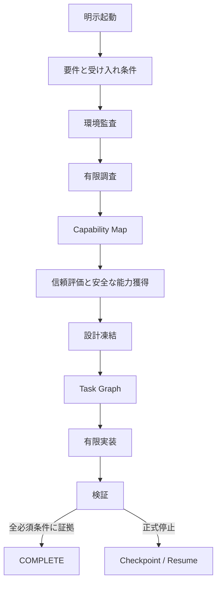

# StackMarshal

**調べ、揃え、制御し、有限に作り切る。**

StackMarshalは、Codex向けのResearch First型オーケストレーションSkillと、
決定論的な補助CLIです。依頼の構造化、環境監査、類似OSS調査、Skills・MCP・
プラグイン・ライブラリ・CLIの探索、安全性とライセンス評価、設計凍結、有限予算での
実装、受け入れ条件の検証、停止時のcheckpoint/resumeを一つの流れにまとめます。

> StackMarshalは「どんな依頼でも必ず完成」を保証しません。
> **証拠付きの`COMPLETE`か、正式かつ再開可能な停止状態**を保証します。

[English README](README.md)

## なぜ必要か

Coding Agentは、調査前に実装を始める、既存OSSを再実装する、古い・危険な依存を
選ぶ、実装中に設計を変え続ける、同じ失敗を反復する、停止時に再開情報を残さない、
といった無駄を起こしやすいです。StackMarshalはそれらを観測可能な上限と正式状態で
制御します。

## 中核となる保証

- **明示起動のみ**：通常の実装依頼では発火しません。
- **必要な場合だけResearch First**：小さな局所修正では調査を省略できます。
- **横断的なCapability Map**：Skill、MCP、プラグイン、ライブラリ、CLI、参考OSSを区別します。
- **Supply Chain防御**：pin、hash、provenance、install hook検査、最小権限、承認ゲート、rollback receipt。
- **Architecture Freeze**：再調査は重大条件に限定し、回数上限を持ちます。
- **有限停止ハーネス**：予算、同一failure fingerprint、停滞、scope driftを検出します。
- **Checkpoint / Resume**：ユーザー領域のHMAC署名でcheckpoint判断を保護し、入力が変わらない限り完了済み範囲を再計算しません。
- **Agent非依存Core**：v1はCodex Adapter、将来は他Agent Adapterへ拡張可能です。

## 起動方法

発火する例：

```text
StackMarshalを使って実装して。
Use StackMarshal to build this feature.
使用 StackMarshal 实现这个功能。
$stackmarshal build
```

発火しない例：

```text
この機能を実装して。
StackMarshalとは？
StackMarshalに似たOSSを比較して。
README内のStackMarshalという表記を直して。
```

## 導入・更新

推奨installerは、CLIを専用virtual environmentへ隔離導入し、同じversionのCodex Skillも
一括で配置します。version固定されたRelease assetsを`SHA256SUMS`で検証し、導入後doctorと
一時ファイル削除まで実行します。

**Windows PowerShell：**

```powershell
irm https://github.com/Soph1yzzz/stackmarshal/releases/latest/download/install.ps1 | iex
```

**macOS / Linux：**

```bash
curl -fsSL https://github.com/Soph1yzzz/stackmarshal/releases/latest/download/install.sh | bash
```

同じcommandを再実行すると、最新stableへのupdate、または同versionのrepairになります。
再現性のためversionを固定する場合：

```powershell
& ([scriptblock]::Create((irm https://github.com/Soph1yzzz/stackmarshal/releases/download/v1.1.0/install.ps1))) -Version v1.1.0
```

```bash
curl -fsSL https://github.com/Soph1yzzz/stackmarshal/releases/download/v1.1.0/install.sh | bash -s -- --version v1.1.0
```

GitとPython 3.11以上が前提です。未導入の場合は、検出結果を説明した上でOS package managerを
使ってよいか確認します。user `PATH`の変更、または編集済み・installer管理外のSkill置換にも
確認が入ります。完全な非対話導入を意図する場合だけ、PowerShellは`-Yes`、Bashは`--yes`を
使用してください。downgradeは`-AllowDowngrade` / `--allow-downgrade`を明示しない限り拒否します。

CLIのRuntime必須依存は**ゼロ**で、現在のPython環境やglobal Pythonへは導入しません。
Skill導入・更新後はCodexを再起動してください。

Skillだけを手動導入する場合も、`main`ではなく対応するRelease tagへ固定します。

```text
$skill-installer install https://github.com/Soph1yzzz/stackmarshal/tree/v1.1.0/skills/stackmarshal
```

## CLI例

```bash
stackmarshal init
stackmarshal invocation "StackMarshalを使って実装して"
stackmarshal start --mode build --budget standard \
  --invocation "StackMarshalを使って実装して"
stackmarshal state show
stackmarshal state transition INTENT_NORMALIZATION
stackmarshal budget check
stackmarshal candidate score candidate.json
stackmarshal failure fingerprint failure.json
stackmarshal progress evaluate current.json --previous previous.json
stackmarshal lock verify .stackmarshal/project/locks/dependencies.lock.json
stackmarshal checkpoint create --next-action "外部ブロッカーを解消する"
stackmarshal resume inspect
```

機械出力はJSONです。invalid input/state、budget exhausted、approval、unsafe、
external blocked、checkpoint、completeをexit codeで区別します。

## Workflow



正式停止状態は`BUDGET_EXHAUSTED`、`STAGNATED`、`REPEATED_FAILURE`、
`APPROVAL_REQUIRED`、`BLOCKED_EXTERNAL`、`UNSAFE_DEPENDENCY`、
`SCOPE_DRIFT`、`INVALID_STATE`、`USER_CANCELLED`です。

## セキュリティモデル

外部README、Issue、コメント、AGENTS、SKILLは未信頼データです。それらの記述は、
コマンド実行、秘密情報の読取、ポリシー変更、再帰呼び出し、公開、COMPLETE判定を
許可できません。StackMarshalはコマンドを分類し、global write、network write、
secret、課金、公開、外部binary、管理者権限を承認対象にします。未知のコマンド形式も
安全と推測せず、承認必須としてfail-closedします。

既存のdirty stateを保護し、run IDの形式、workspace境界、Release入力のsymlinkを検証し、
rollbackをreceiptが実際に作成したファイルだけに制限します。一般的なsecret形式をlogから
redactし、provenanceを保存します。licenseなし、危険なinstall hook、Critical既知脆弱性、
過剰権限、検査不能binary、pin不能な候補は拒否します。

脆弱性報告は[SECURITY.md](SECURITY.md)を参照してください。

Checkpointとacquisition receiptの署名鍵はRepository外の
`~/.stackmarshal/integrity-signing.key`へ保存されます。Checkpointはtracked、staged、untrackedを
含むworktree内容fingerprintも固定します。管理されたユーザー状態領域や鍵移行が必要な場合は、
`STACKMARSHAL_STATE_HOME`または`STACKMARSHAL_SIGNING_KEY_FILE`を設定してください。
鍵を失った状態ファイルは、意図的に黙って信頼されません。

## 開発

```bash
python -m venv .venv
# Windows: .venv\Scripts\activate
# POSIX:   source .venv/bin/activate
python -m pip install -e ".[dev]"
ruff check src tests
mypy src/stackmarshal
coverage run -m pytest
coverage report --fail-under=85
python -m build
python -m twine check dist/*
```

CIはUbuntu、macOS、WindowsでPython 3.11〜3.13を検証します。Windows 11互換は
v1の必須Release Gateです。

## 制限

- v1はCodex専用Adapterで、multi-agent orchestrationではありません。
- LLMが全手順へ必ず従うこと自体は保証できません。Coreが状態、上限、検証、証拠形式を決定論的に管理します。
- Live調査能力はホスト側のGitHub・Web・Registry Adapterへ依存します。
- 脆弱性と名称・商標確認は時間依存なので、Releaseごとに再確認が必要です。
- PyPI公開はGitHub v1 Releaseとは分離しています。

## Contribution / License

[CONTRIBUTING.md](CONTRIBUTING.md)、[CODE_OF_CONDUCT.md](CODE_OF_CONDUCT.md)、
[docs/RFC_PROCESS.md](docs/RFC_PROCESS.md)を参照してください。

Apache License 2.0です。詳細は[LICENSE](LICENSE)を参照してください。
