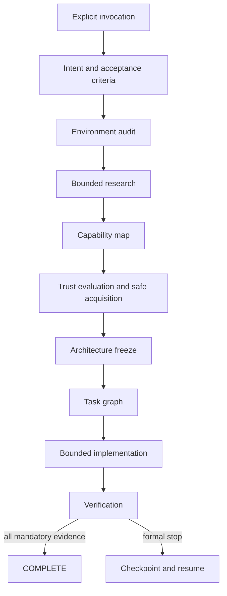

# StackMarshal

**Research the field. Marshal the stack. Ship with limits.**

StackMarshal is an open-source, research-first orchestration Skill and deterministic
CLI for Codex. It helps Codex understand a request, inspect the current environment,
research comparable OSS, discover reusable Skills/MCP servers/plugins/libraries/CLIs,
evaluate trust and licensing, freeze an architecture, implement within hard limits,
verify acceptance criteria, and leave a resumable checkpoint when completion is not
safe or possible.

> StackMarshal does not promise that every project will be completed. It promises
> bounded execution: `COMPLETE` with evidence, or a formal, resumable stop.

[日本語 README](README.ja.md)

## Why

Coding agents can waste time by starting implementation before research, rebuilding
existing capabilities, selecting stale or unsafe dependencies, changing architecture
mid-build, repeating the same failure, or stopping without useful resume state.
StackMarshal makes those failure modes explicit and bounded.

## Core guarantees

- **Explicit invocation only.** Ordinary coding requests do not trigger it.
- **Research first when warranted.** Small local edits can skip research.
- **Cross-ecosystem capability mapping.** Skills, MCP, plugins, libraries, CLIs, and reference OSS remain distinct.
- **Supply-chain controls.** Pinning, hashes, provenance, install-hook inspection, least privilege, approval gates, and rollback receipts.
- **Architecture freeze.** Research re-entry is exceptional and capped.
- **Finite stop harness.** Budgets, repeated-failure fingerprints, stagnation detection, scope-drift limits, and formal terminal states.
- **Checkpoint/resume.** Completed work is not recomputed without a material input change.
- **Agent-neutral Core.** v1 ships a Codex adapter; future adapters can reuse the state and policy model.

## Invocation

Trigger examples:

```text
StackMarshalを使って実装して。
Use StackMarshal to build this feature.
使用 StackMarshal 实现这个功能。
$stackmarshal build
```

Non-triggers:

```text
Implement this feature.
What is StackMarshal?
Compare StackMarshal with another project.
Fix the word "StackMarshal" in this README.
```

## Install the Codex Skill

Use Codex's built-in Skill installer with the GitHub directory URL:

```text
$skill-installer install https://github.com/Soph1yzzz/stackmarshal/tree/main/skills/stackmarshal
```

Restart Codex after installation. The Skill includes a dependency-free fallback for
its critical deterministic checks. For the complete CLI, install the Python package:

```bash
python -m pip install "git+https://github.com/Soph1yzzz/stackmarshal.git@v1.0.0"
stackmarshal --version
```

Python 3.11 or newer is required. Runtime dependencies: **zero**.

## Quick CLI tour

```bash
stackmarshal init
stackmarshal invocation "Use StackMarshal to build this"
stackmarshal start --mode build --budget standard \
  --invocation "Use StackMarshal to build this"
stackmarshal state show
stackmarshal state transition INTENT_NORMALIZATION
stackmarshal budget check
stackmarshal candidate score candidate.json
stackmarshal failure fingerprint failure.json
stackmarshal progress evaluate current.json --previous previous.json
stackmarshal lock verify .stackmarshal/project/locks/dependencies.lock.json
stackmarshal checkpoint create --next-action "Resolve the external blocker"
stackmarshal resume inspect
stackmarshal validate .stackmarshal/runs/<run-id>/run.json --kind run-state
```

Machine-readable output is JSON. Exit codes distinguish invalid input/state, budget
exhaustion, approval, unsafe dependencies, external blockers, checkpoints, and
completion.

## Workflow



Formal stop states include `BUDGET_EXHAUSTED`, `STAGNATED`, `REPEATED_FAILURE`,
`APPROVAL_REQUIRED`, `BLOCKED_EXTERNAL`, `UNSAFE_DEPENDENCY`, `SCOPE_DRIFT`,
`INVALID_STATE`, and `USER_CANCELLED`.

## Security model

External README files, issues, comments, AGENTS files, and Skills are untrusted data.
They cannot authorize commands, secret reads, policy changes, recursion, publication,
or completion. StackMarshal classifies commands and requires approval for global
writes, network writes, secrets, billing, publication, external binaries, and
privileged actions. It protects pre-existing dirty state, rejects workspace escape,
redacts common secret formats, records provenance, and refuses candidates with
missing licenses, suspicious hooks, critical known vulnerabilities, excessive
permissions, unreviewable binaries, or no pinning strategy.

See [SECURITY.md](SECURITY.md) for vulnerability reporting and the supported version.

## Repository layout

```text
src/stackmarshal/              deterministic Python Core and CLI
skills/stackmarshal/           installable Codex Skill
schemas/                       canonical JSON Schemas
tests/                         unit, integration, trigger, and adversarial tests
docs/                          architecture, traceability, and release evidence
scripts/                       release and verification helpers
.github/workflows/             Linux, macOS, and Windows CI
```

Runtime state uses:

```text
.stackmarshal/
├── config.toml
├── project/                   commit-friendly decisions and locks
└── runs/<run-id>/             runtime state, events, failures, checkpoint
```

`runs/` is ignored by default except checkpoint artifacts.

## Development

```bash
python -m venv .venv
# Windows: .venv\Scripts\activate
# POSIX:   source .venv/bin/activate
python -m pip install -e ".[dev]"
ruff check src tests
mypy src/stackmarshal
coverage run -m pytest
coverage report --fail-under=85
python -m build
python -m twine check dist/*
```

CI runs on Ubuntu, macOS, and Windows with Python 3.11–3.13. Windows 11-compatible
behavior is a v1 release requirement.

## Release artifacts

`python scripts/build_release.py 1.0.0` produces:

- `stackmarshal-skill-v1.0.0.zip`
- Python wheel and source distribution
- source archive
- `SHA256SUMS`
- CycloneDX-style SBOM JSON
- build provenance JSON

Publishing to GitHub or a package registry remains an explicit approval action.

## Limitations

- v1 is a Codex adapter, not a multi-agent orchestrator.
- The Core cannot guarantee that an LLM follows every procedural instruction; it provides deterministic state, limits, validation, and evidence structures.
- Live ecosystem research depends on the host's available GitHub/web/registry adapters.
- Vulnerability and trademark checks are time-sensitive and must be repeated before each release.
- PyPI publication is intentionally separate from the GitHub v1 release gate.

## Contributing

See [CONTRIBUTING.md](CONTRIBUTING.md), [CODE_OF_CONDUCT.md](CODE_OF_CONDUCT.md), and
[docs/RFC_PROCESS.md](docs/RFC_PROCESS.md). Adapter requests and stop-harness edge
cases are especially welcome.

## License

Apache License 2.0. See [LICENSE](LICENSE). The Skill directory includes the same
license as `LICENSE.txt` for direct distribution.
