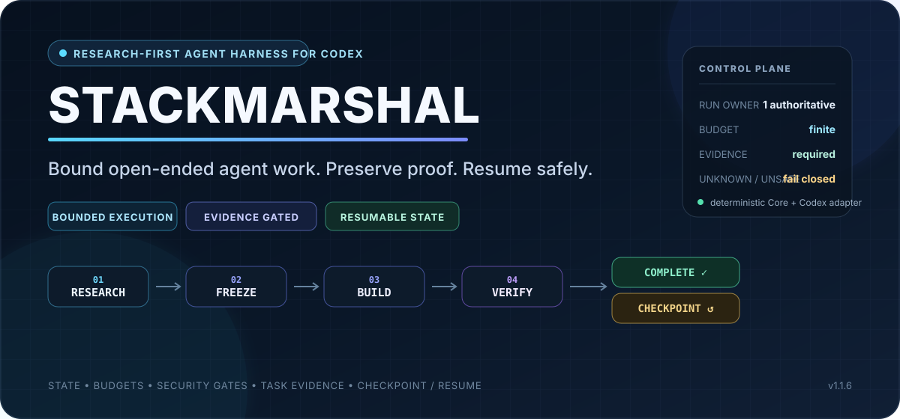
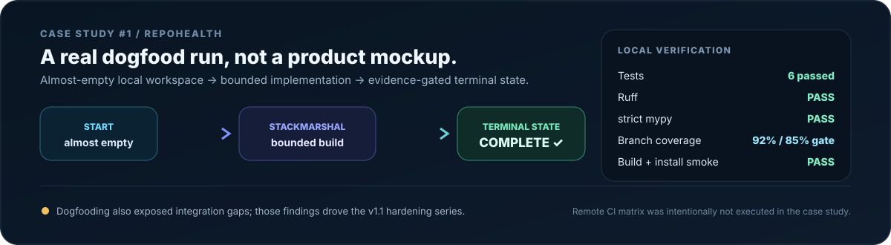
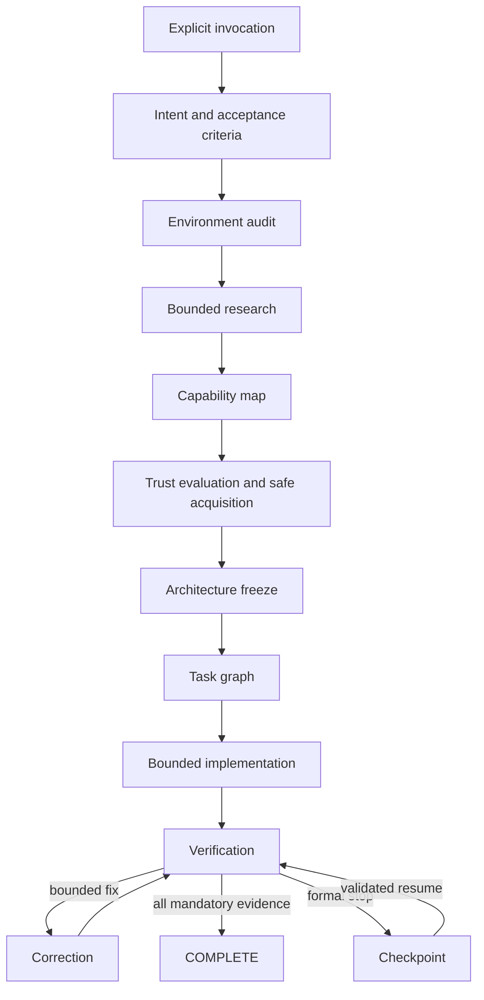

<p align="center">
  <a href="README.ja.md"><strong>日本語</strong></a> · <strong>English</strong>
</p>

<p align="center">
  
</p>

<h1 align="center">StackMarshal</h1>

<p align="center"><strong>A bounded, research-first agent harness for Codex.</strong></p>
<p align="center">Research the field. Marshal the stack. Ship with limits.</p>

<p align="center">
  <a href="https://github.com/Soph1yzzz/stackmarshal/releases/latest"></a>
  <a href="https://github.com/Soph1yzzz/stackmarshal/actions/workflows/ci.yml"></a>
  <a href="https://github.com/Soph1yzzz/stackmarshal/actions/workflows/codeql.yml"></a>
  
  
  
  
</p>

<p align="center">
  <strong><a href="#install-in-one-command">Install</a></strong> ·
  <strong><a href="docs/CASE_STUDY_01_REPOHEALTH.md">Proof</a></strong> ·
  <strong><a href="docs/ARCHITECTURE.md">Architecture</a></strong> ·
  <strong><a href="docs/THREAT_MODEL.md">Security</a></strong> ·
  <strong><a href="docs/README.md">Docs</a></strong>
</p>

StackMarshal turns open-ended Codex work into a **bounded, auditable run**. It normalizes the
request, researches only when warranted, maps reusable capabilities, evaluates trust, freezes the
architecture, implements within explicit limits, verifies mandatory acceptance criteria, and leaves
a resumable checkpoint when safe completion is not possible.

> StackMarshal does not promise that every project will be completed. It promises a finite,
> inspectable outcome: **`COMPLETE` with evidence, or a formal resumable stop.**

## The 30-second version

<table>
  <tr>
    <td width="33%"><strong>BOUND THE RUN</strong><br/>Budgets, attempts, stagnation, and terminal states keep work finite.</td>
    <td width="33%"><strong>PROVE COMPLETION</strong><br/>Canonical task evidence and verification gate <code>COMPLETE</code>.</td>
    <td width="33%"><strong>RESUME SAFELY</strong><br/>Integrity-protected checkpoints bind decisions to repository state.</td>
  </tr>
</table>

| Open-ended agent work | With StackMarshal |
|---|---|
| Starts coding before deciding whether research is needed | Runs an explicit research gate and capability map first |
| Rebuilds existing tools or adds dependencies casually | Separates Skills, MCP, plugins, libraries, CLIs, and reference OSS, then evaluates trust before acquisition |
| Drifts architecture while implementation is underway | Freezes the architecture and caps research re-entry |
| Repeats failures until context or patience runs out | Enforces budgets, attempt limits, stagnation detection, and repeated-failure fingerprints |
| Says "done" without a machine-checkable completion contract | Gates `COMPLETE` on canonical task evidence and verification |
| Stops with context trapped in the chat | Leaves an integrity-protected checkpoint bound to repository state for deterministic resume |

### What makes it different

- **Bounded by construction.** The deterministic Core owns run state, budgets, stop conditions,
  task evidence, and terminal states instead of relying on prompt discipline alone.
- **Research-first, not research-always.** Small local work can skip research; larger work gets a
  bounded field/capability pass before architecture is frozen.
- **Security gates are part of the harness.** Publication, secrets, billing, privilege, global
  writes, external binaries, and network writes remain approval boundaries; unknown command forms
  fail closed.
- **Integrity survives the repository boundary.** User-local HMAC authentication protects live
  run/task authority as well as checkpoints and receipts; resume also binds decisions to repository
  lineage and the exact worktree fingerprint.
- **Codex-specific adapter, agent-neutral Core.** v1 is deliberately not a multi-agent
  orchestrator; the reusable state/policy model is separated from Codex-specific behavior.

### Proven in dogfooding: RepoHealth

<p align="center">
  <a href="docs/CASE_STUDY_01_REPOHEALTH.md"></a>
</p>

In **Case Study #1**, Codex explicitly invoked StackMarshal in a controlled Phase 3B run and built
RepoHealth, a dependency-free OSS-readiness CLI, from an almost-empty local workspace. The accepted
run finished with:

- **6 tests passed**
- **Ruff PASS**
- **strict mypy PASS**
- **92% branch-aware coverage** against an 85% gate
- **wheel + sdist build PASS**
- **local wheel install smoke PASS**
- terminal StackMarshal state: **`COMPLETE`**

The same dogfood also exposed integration gaps instead of hiding them; those findings drove the
v1.1 live-orchestration hardening. Read the full evidence and limitations in
[Case Study #1 — RepoHealth](docs/CASE_STUDY_01_REPOHEALTH.md).

### Field dogfood: MandateMarshal v0.2

**Case Study #2** used StackMarshal during durable-runtime and crash-recovery development in another
OSS project. The run completed five mandatory tasks in five total attempts, recorded one research
round and 72 tool calls, and reached `COMPLETE` only after finalization. Most importantly, after a
late source change StackMarshal rejected stale verification with
`missing_verified_workspace_fingerprint` until the final workspace was verified again.

That field run found three runtime-trust issues carried into v1.1.3: Git porcelain path parsing,
launcher/CLI/Skill version skew, and Windows reserved-device-name fingerprint diagnostics. A later
risk-triggered pre-release security review found a fourth issue—unsigned live run/task authority—which
v1.1.3 also hardens without rewriting the historical field-run evidence. See
[Case Study #2 — MandateMarshal](docs/CASE_STUDY_02_MANDATEMARSHAL.md) ([日本語](docs/CASE_STUDY_02_MANDATEMARSHAL.ja.md)).

### Install in one command

**Windows PowerShell:**

```powershell
irm https://github.com/Soph1yzzz/stackmarshal/releases/latest/download/install.ps1 | iex
```

**macOS / Linux:**

```bash
curl -fsSL https://github.com/Soph1yzzz/stackmarshal/releases/latest/download/install.sh | bash
```

The installer uses a dedicated virtual environment, installs the matching Codex Skill, verifies
versioned Release assets, and runs a post-install doctor check. After that first bootstrap, v1.1.4
made `stackmarshal pin latest` the normal update command; v1.1.5 adds real same-run checkpoint resume,
legacy-state archival, and bounded verification correction. `stackmarshal version` remains the quick
runtime/pin/Skill/launcher drift check. The detailed installation, security, CLI, state, release,
and development contracts remain below.

## Detailed overview

StackMarshal is an open-source, research-first orchestration Skill and deterministic
CLI for Codex. It helps Codex understand a request, inspect the current environment,
research comparable OSS, discover reusable Skills/MCP servers/plugins/libraries/CLIs,
evaluate trust and licensing, freeze an architecture, implement within hard limits,
verify acceptance criteria, and leave a resumable checkpoint when completion is not
safe or possible.

> StackMarshal does not promise that every project will be completed. It promises
> bounded execution: `COMPLETE` with evidence, or a formal, resumable stop.

## Why

Coding agents can waste time by starting implementation before research, rebuilding
existing capabilities, selecting stale or unsafe dependencies, changing architecture
mid-build, repeating the same failure, or stopping without useful resume state.
StackMarshal makes those failure modes explicit and bounded.

## Core guarantees

- **Explicit invocation only.** Ordinary coding requests do not trigger it.
- **Research first when warranted.** Small local edits can skip research.
- **Cross-ecosystem capability mapping.** Skills, MCP, plugins, libraries, CLIs, and reference OSS remain distinct.
- **Supply-chain controls.** Pinning, hashes, provenance, install-hook inspection, least privilege, approval gates, and rollback receipts.
- **Architecture freeze.** Research re-entry is exceptional and capped.
- **Authenticated live authority.** A bounded job has one RUNNING owner, and both live `run.json` authority and the canonical task graph are protected by a user-local HMAC so repository content cannot forge phase/completion state; nested workspaces do not silently inherit an ancestor repository, and allowed repository bootstrap is recorded as lineage migration.
- **Live activity budgets.** Observable Codex work consumes Core-owned counters instead of leaving a decorative zero-use ledger.
- **Canonical task graph.** HMAC-authenticated machine-readable task status and evidence are synchronized into a generated Markdown view and gate `COMPLETE`.
- **Finite stop harness.** Budgets, repeated-failure fingerprints, stagnation detection, scope-drift limits, and formal terminal states.
- **Checkpoint/resume.** The same user-local HMAC integrity boundary protects checkpoints and acquisition receipts; `stackmarshal resume <run-id>` reopens only explicitly resumable stops after validating project identity, Git state, exact worktree fingerprint, and the signed resume phase.
- **Bounded correction.** Small verification fixes use `VERIFICATION -> CORRECTION -> VERIFICATION` without spending the architecture-replan budget.
- **Legacy evidence without trust promotion.** `stackmarshal migrate` archives old unsigned state with hashes instead of silently signing it into current authority.
- **Agent-neutral Core.** v1 ships a Codex adapter; future adapters can reuse the state and policy model.

## Invocation

Trigger examples:

```text
StackMarshalを使って実装して。
Use StackMarshal to build this feature.
使用 StackMarshal 实现这个功能。
$stackmarshal build
```

Non-triggers:

```text
Implement this feature.
What is StackMarshal?
Compare StackMarshal with another project.
Fix the word "StackMarshal" in this README.
```

## Install or update

The recommended installer puts the CLI in a dedicated virtual environment and installs the
matching Codex Skill. It verifies the versioned Release assets against `SHA256SUMS`, runs a
post-install doctor check, and removes its temporary files.

**Windows PowerShell:**

```powershell
irm https://github.com/Soph1yzzz/stackmarshal/releases/latest/download/install.ps1 | iex
```

**macOS / Linux:**

```bash
curl -fsSL https://github.com/Soph1yzzz/stackmarshal/releases/latest/download/install.sh | bash
```

After the one-time bootstrap, normal updates and version management use the CLI itself:

```bash
stackmarshal pin latest
stackmarshal pin status
stackmarshal version
```

Pin an exact release when reproducibility matters:

```bash
stackmarshal pin 1.1.6
```

`stackmarshal version` is the human check: it reports the running CLI, exact managed pin,
installed Skill, resolved launcher, and `OK` / `DRIFTED` status. `stackmarshal --version`
continues to print only the runtime version for scripts. `pin` downloads the selected published
Release bootstrap, verifies that bootstrap against the Release `SHA256SUMS`, and then delegates to
the existing atomic installer, so update/repair/rollback logic remains single-sourced.

Git and Python 3.11 or newer are prerequisites. When either is missing, the bootstrap explains
what it found and asks before using the operating-system package manager. It also asks before
changing the user `PATH` or replacing a modified/unmanaged StackMarshal Skill. Use `-Yes` on
PowerShell or `--yes` on Bash only for a deliberately non-interactive installation. Downgrades
remain blocked unless `-AllowDowngrade` / `--allow-downgrade` is supplied explicitly.

The CLI has **zero required runtime dependencies**. It is not installed into the active/global
Python environment. Restart Codex after installing or updating the Skill. The installer also leaves a
restart-pending marker in the Codex home outside the Skill directory: a stale pre-restart Skill
will refuse StackMarshal invocation, and the matching newly loaded Skill acknowledges the marker
after restart before work can begin.

For a Skill-only manual installation, use the matching release tag:

```text
$skill-installer install https://github.com/Soph1yzzz/stackmarshal/tree/v1.1.6/skills/stackmarshal
```

## Quick CLI tour

```bash
stackmarshal --version
stackmarshal version
stackmarshal pin status
stackmarshal repair --remove-shadowed
stackmarshal init
stackmarshal migrate --dry-run
stackmarshal invocation "Use StackMarshal to build this"
stackmarshal start --mode build --budget standard \
  --invocation "Use StackMarshal to build this"
stackmarshal doctor --host-skill-version 1.1.6
stackmarshal state show
stackmarshal state transition INTENT_NORMALIZATION
stackmarshal budget check
stackmarshal activity record tool-call --amount 2 --detail "bounded host-tool batch"
stackmarshal task add implement --summary "Implement the feature" --acceptance "tests pass"
stackmarshal task start implement
stackmarshal task complete implement --evidence "tests/test_feature.py passed"
stackmarshal state transition CORRECTION
stackmarshal activity record correction --detail "bounded verification fix"
stackmarshal state transition VERIFICATION
stackmarshal finalize
stackmarshal state transition COMPLETE
stackmarshal candidate score candidate.json
stackmarshal failure fingerprint failure.json
stackmarshal progress evaluate current.json --previous previous.json
stackmarshal lock verify .stackmarshal/project/locks/dependencies.lock.json
stackmarshal checkpoint create --next-action "Resolve the external blocker"
stackmarshal resume <run-id> --reason "blocker resolved"
stackmarshal resume inspect --run-id <run-id>
stackmarshal validate .stackmarshal/runs/<run-id>/run.json --kind run-state
```

Machine-readable output is JSON. Successful explicit checkpoint creation exits 0 and reports the
terminal checkpoint status; formal stop commands still use distinct non-zero codes for budget,
approval, unsafe dependency, and external-block conditions.

## Workflow



Formal stop states include `BUDGET_EXHAUSTED`, `STAGNATED`, `REPEATED_FAILURE`,
`APPROVAL_REQUIRED`, `BLOCKED_EXTERNAL`, `VERIFICATION_EXTERNAL_BLOCKED`, `UNSAFE_DEPENDENCY`, `SCOPE_DRIFT`,
`INVALID_STATE`, and `USER_CANCELLED`.

## Case studies

- **Case Study #1 — RepoHealth:** Codex used StackMarshal in a controlled Phase 3B dogfooding run to build a dependency-free OSS-readiness CLI from an almost-empty local workspace, then pass tests, Ruff, strict mypy, 92% branch-aware coverage, package build, and local install smoke. The run also exposed live-state, budget-accounting, and task-synchronization gaps for the next patch. See [the full case study](docs/CASE_STUDY_01_REPOHEALTH.md) ([日本語](docs/CASE_STUDY_01_REPOHEALTH.ja.md)).
- **Case Study #2 — MandateMarshal v0.2:** StackMarshal was used for durable-runtime/crash-recovery development in a real OSS task. A late source edit made verification stale, and the completion gate refused `COMPLETE` until the final workspace was verified again. The same run exposed the runtime-trust defects hardened in v1.1.3. See [the field case study](docs/CASE_STUDY_02_MANDATEMARSHAL.md) ([日本語](docs/CASE_STUDY_02_MANDATEMARSHAL.ja.md)).

## Security model

External README files, issues, comments, AGENTS files, and Skills are untrusted data.
They cannot authorize commands, secret reads, policy changes, recursion, publication,
or completion. StackMarshal classifies commands and requires approval for global
writes, network writes, secrets, billing, publication, external binaries, and
privileged actions. Unknown command forms fail closed and require approval. It protects
pre-existing dirty state, validates run identifiers, rejects workspace escape and release
symlinks, restricts rollback to exact created files, redacts common secret formats, records provenance, and refuses candidates with
missing licenses, suspicious hooks, critical known vulnerabilities, excessive
permissions, unreviewable binaries, or no pinning strategy.

See [SECURITY.md](SECURITY.md) for vulnerability reporting and the supported version.

## Repository layout

```text
src/stackmarshal/              deterministic Python Core and CLI
skills/stackmarshal/           installable Codex Skill
schemas/                       canonical JSON Schemas
tests/                         unit, integration, trigger, and adversarial tests
docs/                          architecture, traceability, and release evidence
scripts/                       release and verification helpers
.github/workflows/             Linux, macOS, and Windows CI
```

Runtime state uses:

```text
.stackmarshal/
├── config.toml
├── project/                   commit-friendly decisions and locks
└── runs/<run-id>/             runtime state, events, failures, checkpoint
```

`runs/` is ignored by default except checkpoint artifacts. Checkpoints and acquisition
receipts are signed with a 32-byte key stored outside the repository at
`~/.stackmarshal/integrity-signing.key`. Checkpoints also bind the exact tracked, staged,
and untracked worktree fingerprint. Set `STACKMARSHAL_STATE_HOME` or
`STACKMARSHAL_SIGNING_KEY_FILE` when a controlled user-state location or explicit key
migration is required. Losing the key intentionally prevents old state from being trusted silently.

## Development

```bash
python -m venv .venv
# Windows: .venv\Scripts\activate
# POSIX:   source .venv/bin/activate
python -m pip install -e ".[dev]"
ruff check src tests
mypy src/stackmarshal
coverage run -m pytest
coverage report --fail-under=85
python -m build
python -m twine check dist/*
python scripts/version_contract.py --check
python scripts/release_gate.py --stage candidate
```

`pyproject.toml [project].version` is the release-version authority. Run
`python scripts/version_contract.py --sync` after intentionally bumping it; CI and the
release builder fail closed if Core, Skill, or living documentation mirrors drift.
After the candidate is committed and the worktree is clean, run
`python scripts/release_gate.py --stage immutable` for the full deterministic release
and platform-bootstrap installer smoke; this mandatory smoke cannot be skipped. When a restricted
local host cannot spawn PowerShell/Bash, `python scripts/smoke_installer.py --direct-installer`
can diagnose the shared installer path, but it does not replace the immutable bootstrap gate.
`--stage published --release-dir <downloaded-assets>` validates the downloaded bundle's expected
asset set, checksums, component versions, manifest/provenance HEAD binding, and local release tag.
The release contract still requires independently recorded GitHub asset digests; bundle-internal
checksums alone are not an authenticity root.

CI runs on Ubuntu, macOS, and Windows with Python 3.11–3.13. Windows 11-compatible
behavior is a v1 release requirement.

## Release artifacts

`python scripts/build_release.py` resolves the current version from `pyproject.toml` and produces:

- `install.ps1`, `install.sh`, and the shared verified `installer.py`
- `stackmarshal-skill-v1.1.6.zip`
- Python wheel and source distribution
- source archive
- `SHA256SUMS`
- CycloneDX-style SBOM JSON
- build provenance and release-manifest JSON

Publishing to GitHub or a package registry remains an explicit approval action.

## Limitations

- v1 is a Codex adapter, not a multi-agent orchestrator.
- The Core cannot guarantee that an LLM follows every procedural instruction; it provides deterministic state, limits, validation, and evidence structures.
- Live ecosystem research depends on the host's available GitHub/web/registry adapters.
- Vulnerability and trademark checks are time-sensitive and must be repeated before each release.
- PyPI publication is intentionally separate from the GitHub v1 release gate.

## Contributing

See [CONTRIBUTING.md](CONTRIBUTING.md), [CODE_OF_CONDUCT.md](CODE_OF_CONDUCT.md), and
[docs/RFC_PROCESS.md](docs/RFC_PROCESS.md). Adapter requests and stop-harness edge
cases are especially welcome.

## License

Apache License 2.0. See [LICENSE](LICENSE). The Skill directory includes the same
license as `LICENSE.txt` for direct distribution.
