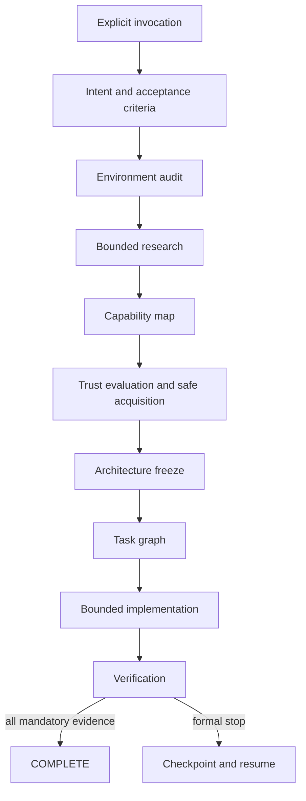

# StackMarshal

**Research the field. Marshal the stack. Ship with limits.**

StackMarshal is an open-source, research-first orchestration Skill and deterministic
CLI for Codex. It helps Codex understand a request, inspect the current environment,
research comparable OSS, discover reusable Skills/MCP servers/plugins/libraries/CLIs,
evaluate trust and licensing, freeze an architecture, implement within hard limits,
verify acceptance criteria, and leave a resumable checkpoint when completion is not
safe or possible.

> StackMarshal does not promise that every project will be completed. It promises
> bounded execution: `COMPLETE` with evidence, or a formal, resumable stop.

[日本語 README](README.ja.md)

## Why

Coding agents can waste time by starting implementation before research, rebuilding
existing capabilities, selecting stale or unsafe dependencies, changing architecture
mid-build, repeating the same failure, or stopping without useful resume state.
StackMarshal makes those failure modes explicit and bounded.

## Core guarantees

- **Explicit invocation only.** Ordinary coding requests do not trigger it.
- **Research first when warranted.** Small local edits can skip research.
- **Cross-ecosystem capability mapping.** Skills, MCP, plugins, libraries, CLIs, and reference OSS remain distinct.
- **Supply-chain controls.** Pinning, hashes, provenance, install-hook inspection, least privilege, approval gates, and rollback receipts.
- **Architecture freeze.** Research re-entry is exceptional and capped.
- **Authoritative live run.** A bounded job has one RUNNING owner; nested workspaces do not silently inherit an ancestor repository, and allowed repository bootstrap is recorded as lineage migration.
- **Live activity budgets.** Observable Codex work consumes Core-owned counters instead of leaving a decorative zero-use ledger.
- **Canonical task graph.** Machine-readable task status and evidence are synchronized into a generated Markdown view and gate `COMPLETE`.
- **Finite stop harness.** Budgets, repeated-failure fingerprints, stagnation detection, scope-drift limits, and formal terminal states.
- **Checkpoint/resume.** User-local HMAC signatures protect checkpoint decisions; completed work is not recomputed without a material input change.
- **Agent-neutral Core.** v1 ships a Codex adapter; future adapters can reuse the state and policy model.

## Invocation

Trigger examples:

```text
StackMarshalを使って実装して。
Use StackMarshal to build this feature.
使用 StackMarshal 实现这个功能。
$stackmarshal build
```

Non-triggers:

```text
Implement this feature.
What is StackMarshal?
Compare StackMarshal with another project.
Fix the word "StackMarshal" in this README.
```

## Install or update

The recommended installer puts the CLI in a dedicated virtual environment and installs the
matching Codex Skill. It verifies the versioned Release assets against `SHA256SUMS`, runs a
post-install doctor check, and removes its temporary files.

**Windows PowerShell:**

```powershell
irm https://github.com/Soph1yzzz/stackmarshal/releases/latest/download/install.ps1 | iex
```

**macOS / Linux:**

```bash
curl -fsSL https://github.com/Soph1yzzz/stackmarshal/releases/latest/download/install.sh | bash
```

Run the same command again to update to the latest stable release or repair the installed
version. Pin a reproducible version when required:

```powershell
& ([scriptblock]::Create((irm https://github.com/Soph1yzzz/stackmarshal/releases/download/v1.1.0/install.ps1))) -Version v1.1.0
```

```bash
curl -fsSL https://github.com/Soph1yzzz/stackmarshal/releases/download/v1.1.0/install.sh | bash -s -- --version v1.1.0
```

Git and Python 3.11 or newer are prerequisites. When either is missing, the bootstrap explains
what it found and asks before using the operating-system package manager. It also asks before
changing the user `PATH` or replacing a modified/unmanaged StackMarshal Skill. Use `-Yes` on
PowerShell or `--yes` on Bash only for a deliberately non-interactive installation. Downgrades
remain blocked unless `-AllowDowngrade` / `--allow-downgrade` is supplied explicitly.

The CLI has **zero required runtime dependencies**. It is not installed into the active/global
Python environment. Restart Codex after installing or updating the Skill. v1.1.1 also leaves a
restart-pending marker in the Codex home outside the Skill directory: a stale pre-restart Skill
will refuse StackMarshal invocation, and the matching newly loaded Skill acknowledges the marker
after restart before work can begin.

For a Skill-only manual installation, use the matching release tag:

```text
$skill-installer install https://github.com/Soph1yzzz/stackmarshal/tree/v1.1.0/skills/stackmarshal
```

## Quick CLI tour

```bash
stackmarshal init
stackmarshal invocation "Use StackMarshal to build this"
stackmarshal start --mode build --budget standard \
  --invocation "Use StackMarshal to build this"
stackmarshal doctor --host-skill-version 1.1.1
stackmarshal state show
stackmarshal state transition INTENT_NORMALIZATION
stackmarshal budget check
stackmarshal activity record tool-call --amount 2 --detail "bounded host-tool batch"
stackmarshal task add implement --summary "Implement the feature" --acceptance "tests pass"
stackmarshal task start implement
stackmarshal task complete implement --evidence "tests/test_feature.py passed"
stackmarshal candidate score candidate.json
stackmarshal failure fingerprint failure.json
stackmarshal progress evaluate current.json --previous previous.json
stackmarshal lock verify .stackmarshal/project/locks/dependencies.lock.json
stackmarshal checkpoint create --next-action "Resolve the external blocker"
stackmarshal resume inspect
stackmarshal validate .stackmarshal/runs/<run-id>/run.json --kind run-state
```

Machine-readable output is JSON. Exit codes distinguish invalid input/state, budget
exhaustion, approval, unsafe dependencies, external blockers, checkpoints, and
completion.

## Workflow



Formal stop states include `BUDGET_EXHAUSTED`, `STAGNATED`, `REPEATED_FAILURE`,
`APPROVAL_REQUIRED`, `BLOCKED_EXTERNAL`, `UNSAFE_DEPENDENCY`, `SCOPE_DRIFT`,
`INVALID_STATE`, and `USER_CANCELLED`.

## Case studies

- **Case Study #1 — RepoHealth:** Codex used StackMarshal in a controlled Phase 3B dogfooding run to build a dependency-free OSS-readiness CLI from an almost-empty local workspace, then pass tests, Ruff, strict mypy, 92% branch-aware coverage, package build, and local install smoke. The run also exposed live-state, budget-accounting, and task-synchronization gaps for the next patch. See [the full case study](docs/CASE_STUDY_01_REPOHEALTH.md) ([日本語](docs/CASE_STUDY_01_REPOHEALTH.ja.md)).

## Security model

External README files, issues, comments, AGENTS files, and Skills are untrusted data.
They cannot authorize commands, secret reads, policy changes, recursion, publication,
or completion. StackMarshal classifies commands and requires approval for global
writes, network writes, secrets, billing, publication, external binaries, and
privileged actions. Unknown command forms fail closed and require approval. It protects
pre-existing dirty state, validates run identifiers, rejects workspace escape and release
symlinks, restricts rollback to exact created files, redacts common secret formats, records provenance, and refuses candidates with
missing licenses, suspicious hooks, critical known vulnerabilities, excessive
permissions, unreviewable binaries, or no pinning strategy.

See [SECURITY.md](SECURITY.md) for vulnerability reporting and the supported version.

## Repository layout

```text
src/stackmarshal/              deterministic Python Core and CLI
skills/stackmarshal/           installable Codex Skill
schemas/                       canonical JSON Schemas
tests/                         unit, integration, trigger, and adversarial tests
docs/                          architecture, traceability, and release evidence
scripts/                       release and verification helpers
.github/workflows/             Linux, macOS, and Windows CI
```

Runtime state uses:

```text
.stackmarshal/
├── config.toml
├── project/                   commit-friendly decisions and locks
└── runs/<run-id>/             runtime state, events, failures, checkpoint
```

`runs/` is ignored by default except checkpoint artifacts. Checkpoints and acquisition
receipts are signed with a 32-byte key stored outside the repository at
`~/.stackmarshal/integrity-signing.key`. Checkpoints also bind the exact tracked, staged,
and untracked worktree fingerprint. Set `STACKMARSHAL_STATE_HOME` or
`STACKMARSHAL_SIGNING_KEY_FILE` when a controlled user-state location or explicit key
migration is required. Losing the key intentionally prevents old state from being trusted silently.

## Development

```bash
python -m venv .venv
# Windows: .venv\Scripts\activate
# POSIX:   source .venv/bin/activate
python -m pip install -e ".[dev]"
ruff check src tests
mypy src/stackmarshal
coverage run -m pytest
coverage report --fail-under=85
python -m build
python -m twine check dist/*
```

CI runs on Ubuntu, macOS, and Windows with Python 3.11–3.13. Windows 11-compatible
behavior is a v1 release requirement.

## Release artifacts

`python scripts/build_release.py 1.1.0` produces:

- `install.ps1`, `install.sh`, and the shared verified `installer.py`
- `stackmarshal-skill-v1.1.0.zip`
- Python wheel and source distribution
- source archive
- `SHA256SUMS`
- CycloneDX-style SBOM JSON
- build provenance and release-manifest JSON

Publishing to GitHub or a package registry remains an explicit approval action.

## Limitations

- v1 is a Codex adapter, not a multi-agent orchestrator.
- The Core cannot guarantee that an LLM follows every procedural instruction; it provides deterministic state, limits, validation, and evidence structures.
- Live ecosystem research depends on the host's available GitHub/web/registry adapters.
- Vulnerability and trademark checks are time-sensitive and must be repeated before each release.
- PyPI publication is intentionally separate from the GitHub v1 release gate.

## Contributing

See [CONTRIBUTING.md](CONTRIBUTING.md), [CODE_OF_CONDUCT.md](CODE_OF_CONDUCT.md), and
[docs/RFC_PROCESS.md](docs/RFC_PROCESS.md). Adapter requests and stop-harness edge
cases are especially welcome.

## License

Apache License 2.0. See [LICENSE](LICENSE). The Skill directory includes the same
license as `LICENSE.txt` for direct distribution.
